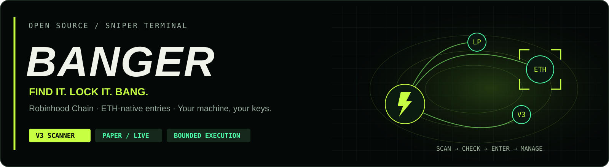
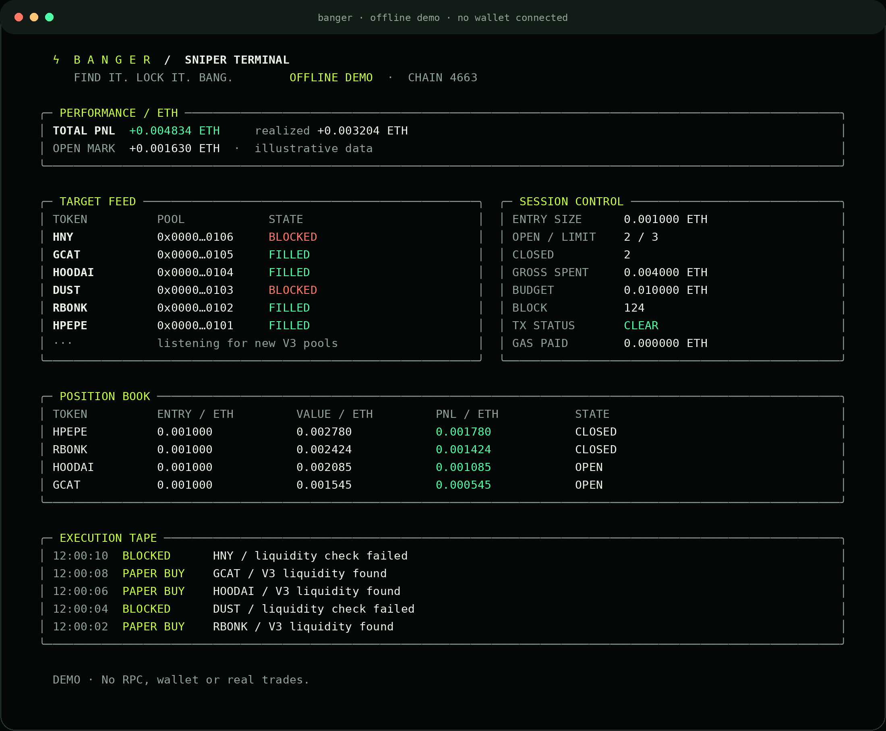
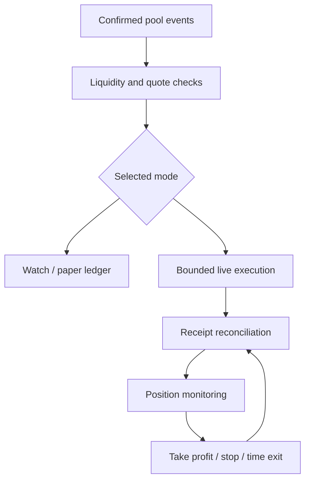

<div align="center">



**New pools. Measured entries. Controlled exits.**

A self-hosted sniper engine for WETH pairs on Robinhood Chain.


[Quick start](#quick-start) · [How it works](#how-it-works) · [Configuration](docs/CONFIGURATION.md) · [Українською](docs/START_UA.md)

</div>

---

## Built to run on your machine

BANGER watches confirmed pool-creation events, checks active liquidity and
trade quotes, and can enter qualifying pools with a fixed ETH amount. Open
positions are monitored for take-profit, stop-loss and time-based exits.

The terminal, scanner, transaction engine and persistence layer are included.
There is no subscription service, hosted wallet, mandatory API key or embedded
fee recipient. Keys remain in your local environment.



*The screenshot is the included offline demo. It is not a trading result.
[Vector version](docs/assets/terminal.svg).*

## What is implemented

| Component | Behavior |
| --- | --- |
| Pool discovery | Confirmed `PoolCreated` events, bounded historical lookback, adaptive log ranges and a saved cursor. |
| Entry gates | Canonical pool identity, WETH pairing, allowed fee tier, pool age, active liquidity, WETH balance and bounded quoted price movement. |
| Execution | Native ETH buys; exact token approvals; token sells unwrapped back into native ETH. Classic V3 Router and SwapRouter02 are supported. |
| Position management | Configurable take-profit, stop-loss and maximum holding time. Failed exits retain the position and retry. |
| Accounting | Integer wei arithmetic, actual receipt transfers, recorded gas, separate realized and quoted unrealized PNL. |
| Recovery | Signed transaction saved before broadcast. An unresolved transaction blocks new signatures; recovery checks or rebroadcasts the same hash. |
| Operator controls | Persistent entry pause, single-process state lock, independent state for each mode / chain / wallet, graceful shutdown. |
| Presentation | Black-and-lime terminal, event tape, position book and responsive column layout. |

## Choose a mode

| Mode | Data | Signs transactions | Requires a wallet key |
| --- | --- | --- | --- |
| `demo` | Deterministic offline illustration | No | No |
| `watch` | On-chain pools and quotes | No | No |
| `paper` | On-chain quotes, simulated fills | No | No |
| `live` | On-chain execution and receipts | **Yes** | **Yes, locally** |

The default is **watch**. Paper PNL excludes gas, and its quotes do not change
pool state. It is useful for observing a strategy, not for proving profitability.

## Quick start

Install Node.js 22 or newer. Download this repository, open its folder in a
terminal, then run:

```bash
npm ci
npm run demo
```

For on-chain monitoring, copy `.env.example` to `.env`, review the RPC and
deployment addresses, and run:

```bash
npm run doctor
npm start
```

`doctor` verifies the RPC chain ID, deployed contract code and the router /
quoter factory and WETH relationships. It also selects the router ABI. It
must succeed before the engine starts.

Try the strategy without sending transactions:

```bash
npm start -- --mode paper
```

Useful commands:

```bash
npm run demo -- --once
npm start -- --headless
node --import tsx src/cli.ts status
node --import tsx src/cli.ts pause
node --import tsx src/cli.ts resume
```

In the interactive terminal: **p** pauses new entries, **r** resumes them,
and **q** stops the process. Existing positions continue to be managed while
entries are paused. Quitting does **not** liquidate positions.

### Deliberately enable live trading

First review [network support](docs/NETWORKS.md), the
[configuration reference](docs/CONFIGURATION.md) and
[recovery behavior](docs/OPERATIONS.md). Use a dedicated wallet whose ETH you
are prepared to risk. Never put a seed phrase in this project.

In your local, ignored `.env`:

```dotenv
MODE=live
PRIVATE_KEY=YOUR_DEDICATED_WALLET_PRIVATE_KEY
LIVE_ACK=I_ACCEPT_REAL_TRADES
```

Then run `npm run doctor` and `npm start`. Keep the initial size and session
budget small. A working swap, a reverse quote or a stop-loss rule cannot
guarantee that a malicious or illiquid token can later be sold.

## How it works



Before each live transaction, BANGER simulates the call, estimates gas,
checks the fee and balance limits, saves the signed transaction, then
broadcasts. On restart it reconciles the pending hash before doing anything
else. Confirmed buys and exits are accounted from transaction receipts.

## Network scope and validation

This version handles **single-hop Uniswap V3 pools paired with WETH**. It can
observe compatible PONS V1 launches using the configured V3 deployment. It
does **not** implement PONS V2 bonding curves, Uniswap V4, non-WETH quote
assets, fee-on-transfer / rebasing tokens, mempool front-running or bundles.

The example deployment addresses are from published protocol documentation.
Mainnet RPC verification was unavailable in the build environment; **a live
Robinhood Chain trade has not been tested here**. Run `doctor` with a working
RPC and independently verify deployments before using a key. This is an
unaudited MVP, not a claim of profit or “first-block” execution.

The integration test deploys the actual published Uniswap V3 Factory, Pool,
QuoterV2, Position Manager, classic SwapRouter and SwapRouter02 artifacts on
an isolated local EVM. It verifies:

- Discovery and paper execution without wallet transactions.
- An actual ETH buy and received token balance.
- Recovery after a simulated lost RPC response without a duplicate buy.
- Exact approvals and an actual token-to-native-ETH exit through both routers.
- Receipt-based PNL and a gas-budget refusal that sends nothing.

```bash
npm run check
```

Tests generate temporary local wallets. They never use `.env` keys or send
mainnet transactions. Development-only test dependencies include Ganache
and published Uniswap contract artifacts; they are not loaded by the bot.

See the [validation record](docs/VALIDATION.md) for the tested environment
and the limits of these checks. Regenerate the vector graphics with
`npm run docs:render`; export the terminal SVG to PNG when updating its
README snapshot.

## Project map

| File | Purpose |
| --- | --- |
| `src/cli.ts` | Commands, terminal lifecycle and operator controls. |
| `src/config.ts` | Validated settings and integer amount handling. |
| `src/v3.ts` | Deployment checks, discovery, pool reads, quotes and calldata. |
| `src/engine.ts` | Entry gates, budgets and position lifecycle. |
| `src/transactions.ts` | Signing, write-ahead journal and receipt reconciliation. |
| `src/store.ts` | Atomic persistence and exclusive process lock. |
| `src/terminal.ts` | BANGER terminal presentation. |
| `test/` | Unit and real-contract local integration tests. |

See [Operations](docs/OPERATIONS.md) for deployment and crash recovery.

---

**Independent software.** Not affiliated with Robinhood, PONS or Uniswap.
The BANGER video concept and its illustrated PNL are not evidence of this
code's financial performance. MIT licensed; see [LICENSE](LICENSE).
